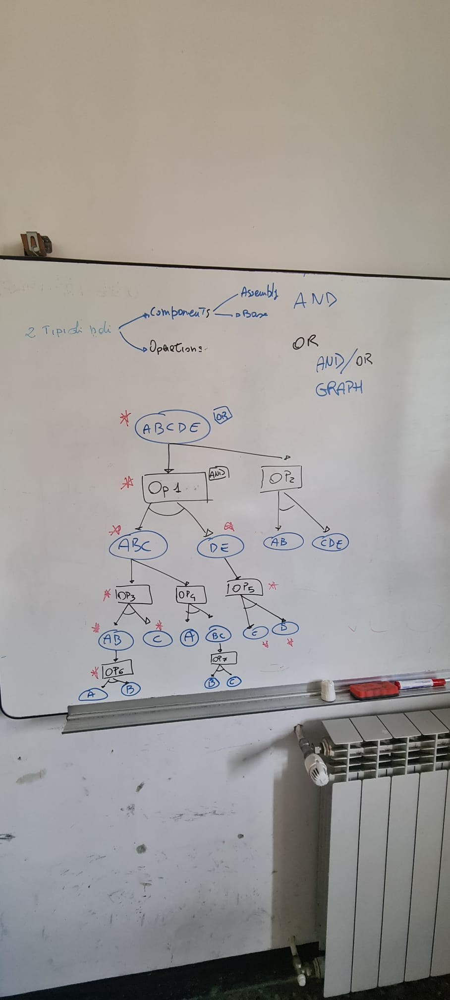

In this notes I am trying to show the object/action operation that I have in mind. It is a sort of and/or graph, where as showed in figure there are two different type of nodes :
1) Components
2) Operations

Components can be connected only to operation nodes and viceversa. 
In figure I have shown an example :
Imagine to have an assembly composed by the foolowing parts listed in the BOM: A, B, C, D, E
Then this object is the root of the graph in the figure. To this object I can either apply different type of operations (OP1 **or** OP2) that split the root object into different parts: ABC **and** DE. Then to ABC I can apply either OP3 **or** OP4. OP3 split the object into AB **and*** C, while AB can be splitted into A **and** B. 
This representation captures different disassembly strategies, so for example the red asterisk represent a strategy, but we can have another strategy
